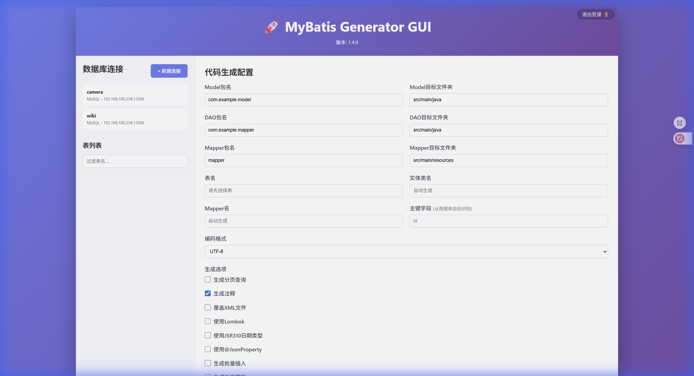

# MyBatis Generator GUI  

<p align="center">
  
  
  
</p>

基于Go语言和Gin框架开发的MyBatis代码生成器Web应用，用于快速生成MyBatis的Java实体类、Mapper接口和XML映射文件。

## 📸 界面预览

### 登录界面


### 主界面


## ✨ 核心特性

- 🌐 **Web界面** - 现代化Web技术，浏览器访问，无需安装
- 🗄️ **多数据库支持** - MySQL 和 PostgreSQL
- 💾 **配置持久化** - SQLite本地存储连接和生成配置
- 🔄 **自动命名转换** - 下划线命名自动转换为驼峰命名
- 📦 **完整代码生成** - 实体类、Mapper接口、XML映射文件一键生成
- 📥 **ZIP自动打包** - 生成后自动打包下载
- 🔐 **登录认证** - 基于Cookie的简单认证保护

## 🚀 快速开始

### 方式一：从源码运行

```bash
git clone https://github.com/yourusername/mybatis-generator-gui-go.git
cd mybatis-generator-gui-go
go mod tidy
go run cmd/main.go
```

### 方式二：编译后运行

```bash
# Windows
.\build.bat
.\mgg.exe

# Linux
./build.sh
./mgg
```

启动后访问：**http://localhost:8080**

### 命令行参数

```bash
./mgg -p 9090  # 指定端口
./mgg -v       # 显示版本
./mgg -h       # 显示帮助
```

## 📖 使用说明

1. **创建数据库连接** - 点击"新建连接"，填写连接信息，点击"测试连接"验证
2. **选择表** - 选择连接后，加载表列表，选择要生成代码的表
3. **配置生成选项** - 设置包名、输出目录、生成选项等
4. **生成代码** - 点击"生成代码"按钮，自动下载ZIP文件

### 生成选项说明

| 选项 | 说明 |
|------|------|
| 注释生成 | 从数据库注释生成Java注释 |
| Lombok | 使用@Data注解简化代码 |
| 分页查询 | 生成分页查询方法 |
| JSR310 | 使用LocalDate/LocalDateTime |
| 覆盖XML | 重新生成时覆盖已存在的XML |
| 构造方法 | 生成无参/全参构造方法 |
| toString等 | 生成toString/hashCode/equals方法 |
| @JsonProperty | 添加Jackson注解 |
| 批量操作 | 生成批量插入/更新方法 |
| FOR UPDATE | SELECT语句添加悲观锁 |
| 表别名 | SQL使用表别名避免列名冲突 |
| 实际列名 | 保持数据库列名不转驼峰 |

### v1.5 新增特性

- 🎯 **多表选择** - 支持同时选择多张表批量生成代码
- 📋 **列定制** - 可自定义列属性名、Java类型，或忽略特定列
- 🔄 **表切换** - 列定制弹窗内可切换查看不同表的列
- 🛡️ **无主键支持** - 正确处理没有主键的表

### v1.7 新增特性 (自定义代码片段)

- 🧩 **可视化片段生成** - 全新 Tab 支持图形化配置 SELECT、INSERT、UPDATE、DELETE 自定义代码片段
- 🔍 **高级条件构建器** - 集成 React QueryBuilder 风格的高级条件组合器，支持 AND/OR 拼接
- ✨ **智能类型推断** - 从表结构及用户自定义列信息中自动推断 Java 入参类型，杜绝类型错乱
- 🚀 **多算子支持** - 完美支持 IN / NOT IN 等高级查询，后台自动智能生成安全的 `<foreach>` 循环标签
- 🧠 **智能命名与防重** - 自动生成语义化的方法名（如 `selectByStatusIn`），并支持智能防重检查
- 🔧 **无缝并入** - 自动将自定义代码片段追加合并至原有的 Mapper.java 及 Mapper.xml 中

## 🗺️ Tab2 自定义片段功能路线图

> 按顺序实现，完成一个勾选一个。**下次从第一个未勾选项继续。**

- [x] **#1 方法名重复自动追加序号** — 重复时自动生成 `selectByStatus_2`，不再报错阻塞 _(v1.7.5)_
- [x] **#2 WHERE 条件互斥校验** — 同一字段 `=` 只能设置一次，`IS NULL` 与 `IS NOT NULL` 互斥，实时高亮警告 _(v1.7.5)_
- [x] **#3.1 WHERE 固定值 / 变量切换** — 每条条件可选「变量参数」或「固定值」，固定值直接内嵌 SQL
- [x] **#4 预览改为内联展开** — 每条已配置片段行右侧 👁️ 按钮，点击在列表下方就地展开 Java/XML 代码；全局预览同样改为页面底部内联展开
- [x] **#5 字段选择改为下拉搜索框** — SELECT / INSERT / SET 字段面板改用可搜索多选下拉框（Tom Select）
- [x] **#7 ORDER BY 字段优先级角标** — 选中字段左上角显示数字角标（1,2,3…）表示排序优先级
- [x] **#8 WHERE 动态输入框** — 根据字段类型切换 number / text / date / datetime / boolean 输入控件（依赖 #3.1）
- [x] **#3.2 聚合函数与字段别名** — SELECT 字段支持配置 COUNT/SUM/MAX/MIN/AVG + AS 别名
- [x] **#3.3 LIMIT 支持** — SELECT 操作新增 LIMIT 配置（固定值或变量参数）


## 🛠️ 技术栈

| 组件 | 技术 |
|------|------|
| 语言 | Go 1.20+ |
| Web框架 | Gin |
| 前端 | HTML5 + CSS3 + JavaScript |
| 数据库驱动 | go-sql-driver/mysql, lib/pq |
| 本地存储 | SQLite |

## 📂 项目结构

```
mybatis-generator-gui-go/
├── cmd/main.go          # 入口文件
├── internal/
│   ├── api/             # REST API
│   ├── config/          # 配置管理
│   ├── database/        # 数据库操作
│   ├── generator/       # 代码生成器
│   ├── utils/           # 工具函数
│   └── web/             # 前端资源
├── docs/screenshots/    # 截图
├── build.bat/.sh        # 构建脚本
└── README.md
```

## 🧪 运行测试

```bash
go test ./...            # 运行测试
go test ./... -cover     # 显示覆盖率
```

## 📄 许可证

Apache 2.0 - 查看 [LICENSE](LICENSE) 了解详情

## 🙏 致谢

本项目参考了 [mybatis-generator-gui](https://github.com/zouzg/mybatis-generator-gui)

---

⭐ 如果这个项目对你有帮助，请给个Star支持！
